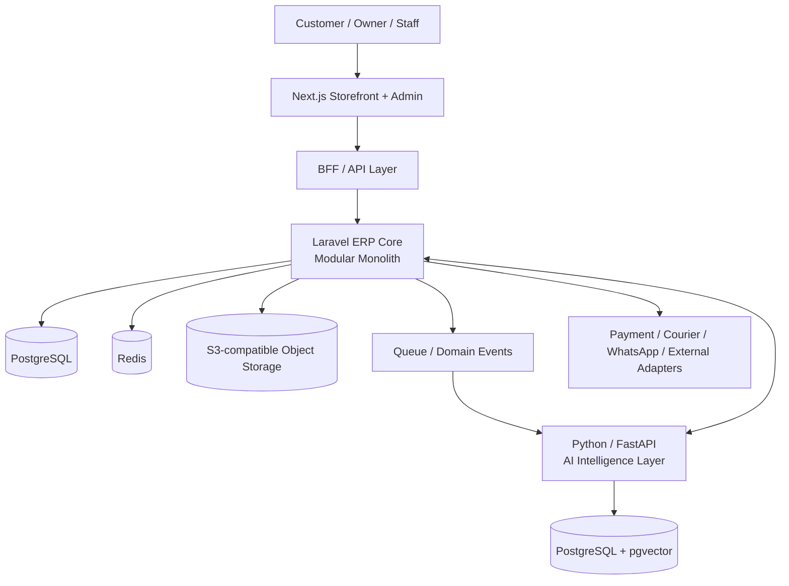

# ADR-0001 — Phase 0 Foundation Architecture

- Status: Accepted for Phase 0
- Date: 2026-09-12
- Scope: Callme Yoghurt Enterprise Commerce & ERP Platform

## Context

The repository currently mixes several architectural directions: Next.js storefront/BFF code, Prisma direct PostgreSQL access, a partial Laravel-oriented ERP scaffold, a FastAPI logistics prototype, PostgreSQL, MongoDB, and Redis. This creates ambiguous ownership for transactional data and business rules.

Phase 0 exists to remove that ambiguity before further feature development.

## Decision

### 1. Transactional authority

Laravel ERP Core is the sole transactional business authority for commerce and ERP domains. *(Note: Framework runtime lifecycle and major version update to Laravel 13 / PHP 8.3 is recorded in ADR-0002).*

The ERP Core will be implemented as a modular monolith first. Domain boundaries must remain explicit so that a bounded context can be extracted into a service later only when operational evidence justifies it.

### 2. Primary system of record

PostgreSQL is the primary system of record for transactional and relational business data.

Examples include:
- customers and partners
- catalog and variants
- prices
- sales and purchase orders
- inventory
- batches/lots
- reservations and allocations
- manufacturing
- procurement
- payments and finance data

### 3. Frontend and BFF

Next.js provides the Storefront and Admin UI. Browser clients do not directly own or mutate ERP persistence.

The BFF/API layer may validate edge-facing request shape, normalize presentation concerns, manage sessions, and call internal application APIs. It must not become a second source of business truth.

Client-provided values such as price, total, stock, product weight, or authoritative availability must never be trusted as final business values.

### 4. Prisma

Prisma is not an independent production transactional authority while Laravel ERP Core owns the domain.

The existing Prisma schema is treated as architecture/domain exploration input during Phase 0. Its useful concepts may be migrated into the authoritative ERP persistence model. Direct Next.js-to-PostgreSQL transactional writes must be removed from the target architecture.

### 5. Redis

Redis is retained for bounded ephemeral and coordination concerns such as:
- cache
- queue infrastructure
- rate limiting
- idempotency keys
- temporary state
- distributed coordination/locks where required

Redis is not the permanent business system of record.

### 6. MongoDB

MongoDB is deferred. It must not be part of the default production architecture until a concrete bounded use case demonstrates why PostgreSQL/JSONB and object storage are insufficient.

### 7. Object storage

Binary and large object data must use S3-compatible object storage rather than PostgreSQL blobs. Examples include:
- complaint evidence
- product media
- PDFs
- exported reports
- AI knowledge source files

Metadata and references remain in PostgreSQL.

### 8. AI Intelligence Layer

Python/FastAPI is retained as a dedicated Intelligence Layer, not as a duplicate ERP transactional backend.

Its intended capabilities include:
- RAG and embeddings
- customer AI concierge
- owner/business copilot
- forecasting
- anomaly detection
- recommendation
- optimization
- bounded agentic workflows

The ERP remains authoritative. AI may read, analyze, recommend, and create controlled drafts through approved tools and permissions. AI must not bypass deterministic business rules.

### 9. AI data access

AI services must use approved business tools/APIs rather than unrestricted production SQL execution.

Structured business questions should use deterministic ERP query tools. Unstructured knowledge retrieval should use RAG. PostgreSQL + pgvector is the default initial vector architecture unless scale proves a dedicated vector database is necessary.

### 10. API contracts

OpenAPI is the canonical service contract format between ERP APIs and client/service consumers. Generated or validated contracts should be preferred over manually duplicated request/response types.

### 11. Async processing

Slow side effects such as notifications, document generation, analytics, courier synchronization, and AI processing should be asynchronous where appropriate.

Domain events are the initial abstraction. Transactional outbox should be introduced before external event delivery becomes business-critical.

### 12. Storage lifecycle

Every persistent data class must have a retention and lifecycle policy. The target storage model is:

- PostgreSQL: business truth
- Object storage: binary truth
- Redis: ephemeral state
- pgvector: AI knowledge index
- observability store: logs/traces/metrics
- backup storage: disaster recovery

Temporary data must use TTL where appropriate. Media and logs must not be retained forever by default.

### 13. Security boundary

A BFF is not inherently a security boundary. Internal ERP APIs require explicit service authentication and authorization where applicable. Secrets must never be included in business payloads, browser responses, client state, or application logs.

### 14. Human control over AI actions

AI autonomy is graduated:

1. read/answer
2. analyze/recommend
3. create draft
4. human-approved execution
5. bounded automation only where explicitly approved

High-risk actions involving finance, destructive data changes, permissions, security, or inventory force-adjustments require explicit controls and auditability.

## Target logical architecture

## Consequences

### Positive

- one transactional authority
- simpler consistency model
- reduced operational complexity
- easier testing and auditing
- clearer AI security boundary
- scalable without premature microservices
- lower storage duplication risk

### Trade-offs

- Laravel ERP Core becomes a critical platform component and requires strong modular discipline
- migration away from direct Prisma-based transactional access requires deliberate work
- MongoDB and independent microservices are intentionally postponed
- AI features must use governed tool interfaces rather than unrestricted database access

## Gate rule

No architectural component may be marked VERIFIED or PRODUCTION-READY solely because scaffolding exists. Evidence must include runnable implementation and the required tests for that maturity level.
