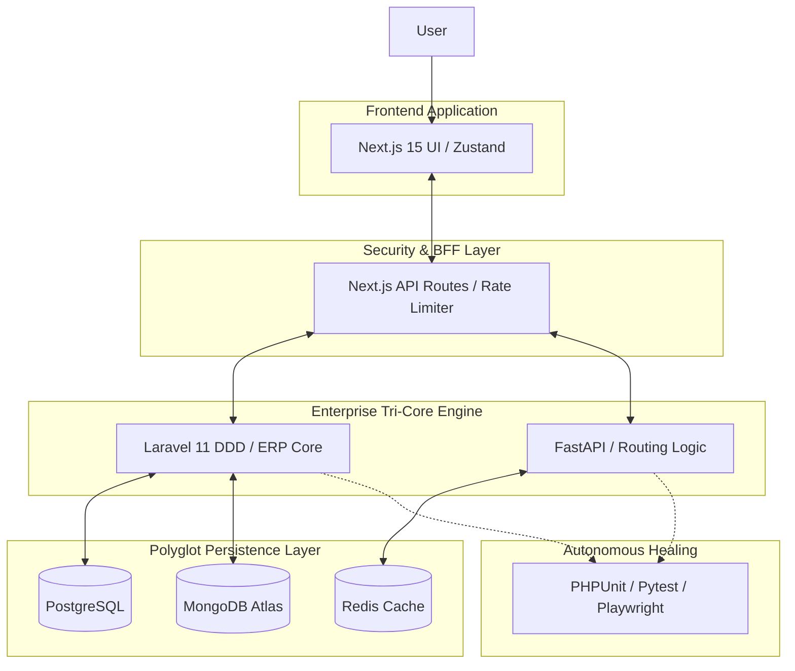

# Enterprise System Design Blueprint

```mermaid
graph TD
    subgraph Client_Side [Frontend Application]
        UI[Next.js 15 UI / Zustand]
    end

    subgraph API_Gateway [Security & BFF Layer]
        BFF[Next.js API Routes / Rate Limiter]
    end

    subgraph Microservices [Enterprise Tri-Core Engine]
        LARAVEL[Laravel 11 DDD / ERP Core]
        PYTHON[FastAPI / Routing Logic]
    end

    subgraph Data_Storage [Polyglot Persistence Layer]
        PGSQL[(PostgreSQL)]
        MONGO[(MongoDB Atlas)]
        REDIS[(Redis Cache)]
    end
    
    subgraph Testing_Loop [Autonomous Healing]
        QA[PHPUnit / Pytest / Playwright]
    end

    User --> UI
    UI <--> BFF
    BFF <--> LARAVEL
    BFF <--> PYTHON
    LARAVEL <--> PGSQL
    LARAVEL <--> MONGO
    PYTHON <--> REDIS
    LARAVEL -.-> QA
    PYTHON -.-> QA
```
