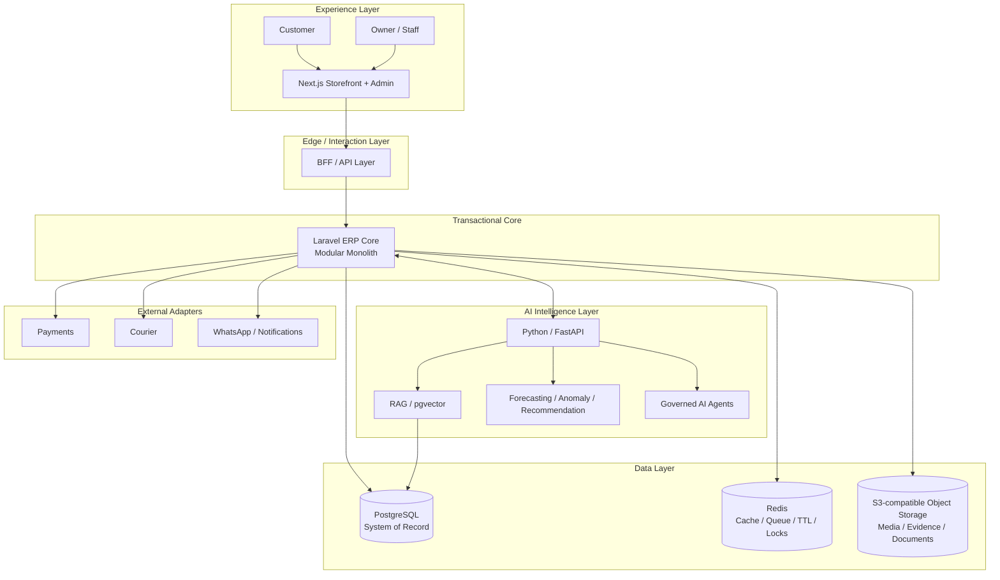
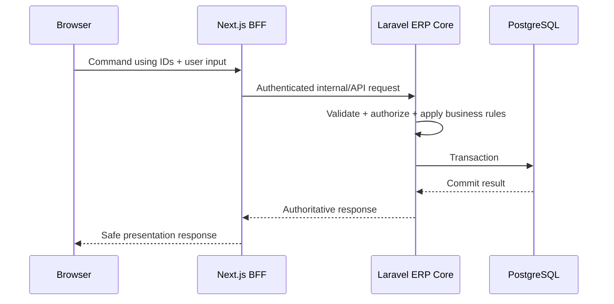
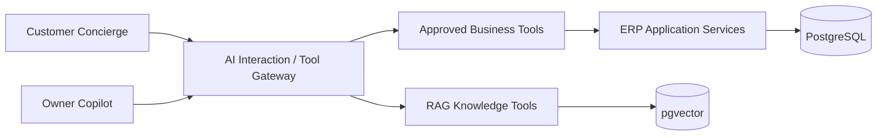

# Callme Yoghurt — System Design

> Architecture status: **Phase 0 — Foundation Repair**
>
> Canonical decision: [ADR-0001 — Phase 0 Foundation Architecture](./ADR/0001-foundation-architecture.md)

## Target Architecture

## Core Rules

### ERP owns transactional truth

Laravel ERP Core is the single transactional authority for catalog, pricing, customers, sales, inventory, manufacturing, procurement, logistics, payments, and later finance concerns.

Next.js must not become an independent transactional backend. Browser-submitted price, total, stock, weight, and authoritative availability are untrusted inputs.

### PostgreSQL is the primary system of record

PostgreSQL stores relational business truth. JSONB may be used for justified flexible metadata.

MongoDB is **deferred** during Phase 0 and must not be treated as a required production dependency until a concrete use case is documented in an ADR.

### Redis is ephemeral infrastructure

Redis is for cache, queue support, rate limiting, idempotency, temporary state, and coordination. Permanent business truth must not depend exclusively on Redis.

### Binary data belongs in object storage

Complaint evidence, media, documents, generated files, and similar binary data belong in S3-compatible object storage. PostgreSQL stores metadata, ownership, hashes, retention information, and object references.

### FastAPI is the Intelligence Layer

Python/FastAPI is reserved for AI/ML and computational capabilities such as RAG, customer concierge, owner copilot, forecasting, anomaly detection, recommendation, optimization, and governed agents.

Simple deterministic commerce or logistics rules should remain in the ERP Core unless there is a proven reason to extract them.

### AI is not a source of truth

AI can read through approved tools, analyze, recommend, and create controlled drafts. Deterministic ERP rules, authorization, pricing, accounting, inventory validity, and transaction integrity remain authoritative.

Unrestricted AI-generated SQL against production is not part of the target architecture.

## Request Boundary

A BFF is not a security boundary by itself. Internal APIs require appropriate authentication/authorization and must never expose service credentials in business payloads or browser responses.

## AI Interaction Boundary

Customer and owner AI experiences use different permission/tool registries. The model only receives capabilities explicitly exposed for the active actor and workflow.

## Storage Architecture

| Data class | Primary store | Notes |
|---|---|---|
| Transactional business data | PostgreSQL | authoritative |
| AI vectors / knowledge index | PostgreSQL + pgvector | initial architecture |
| Media / complaint evidence / PDFs | Object storage | lifecycle + retention required |
| Cache / idempotency / temporary AI state | Redis | TTL where applicable |
| Logs / traces / metrics | Observability storage | separate retention policy |
| Backups | Backup storage | encrypted rotation / PITR target |

## Maturity Labels

Architecture and feature documents must use evidence-based maturity labels:

- `PLANNED`
- `SCAFFOLDED`
- `IMPLEMENTED`
- `TESTED`
- `VERIFIED`
- `PRODUCTION-READY`

A component must not be promoted based only on files existing or a command returning success.

## Phase 0 Exit Principle

Phase 0 is complete only when the documented architecture matches runnable code, P0 security issues are closed, the ERP Core is actually bootable, a real checkout transaction reaches the authoritative backend/database, critical tests execute without false-positive skips, and the architecture certification checklist passes.
